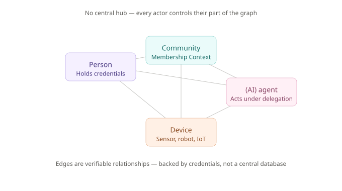
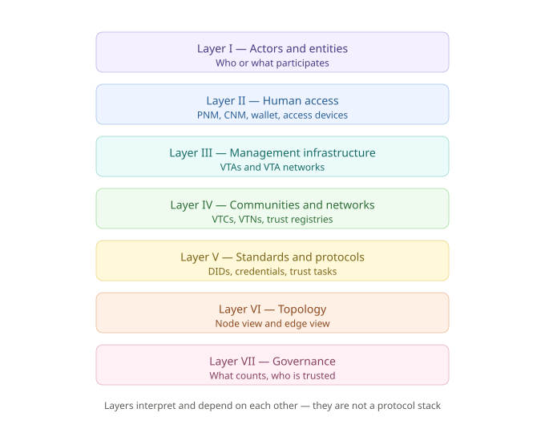
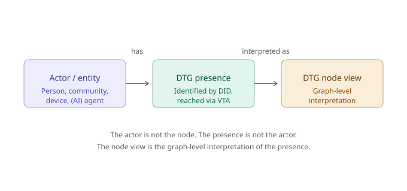
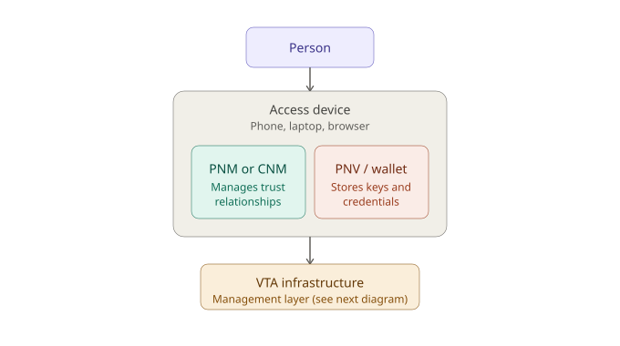
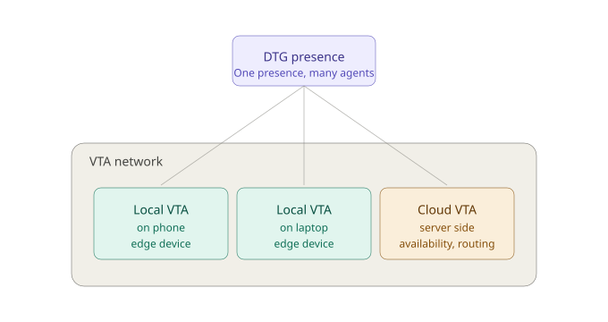
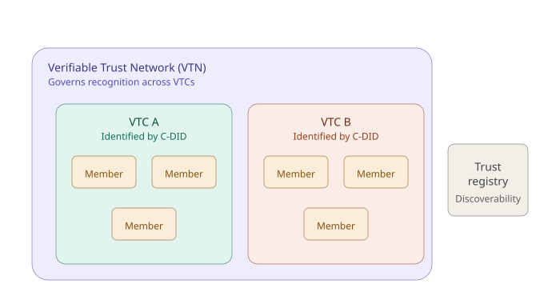
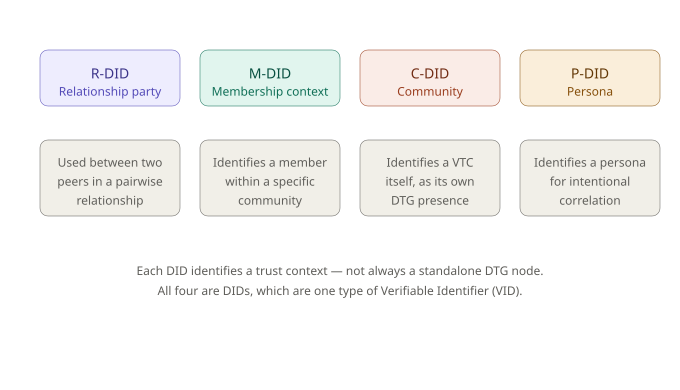
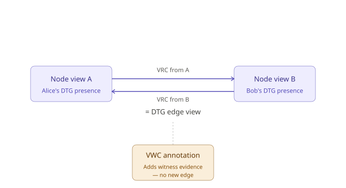
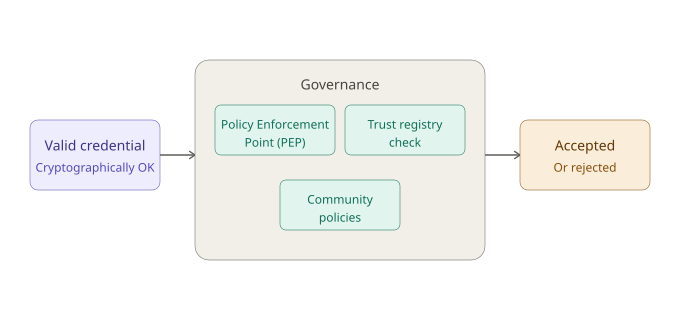
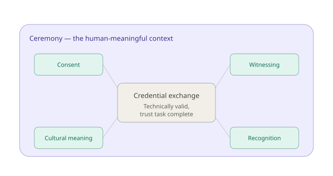

# Decentralized Trust Graph
## Hybrid Interaction Architecture — Baseline

> **Version:** Draft baseline v0.1  
> **Created:** 2026-05-20  
> **Updated:** 2026-05-25  
> **Scope:** Contributor-facing architecture alignment document    
> **Editor:** [Martina Kolpondinos](https://github.com/martipos)    
> **Authority:** Informative, not a DTG specification   
> **Source basis:** DTG Glossary, DTG Credentials draft, First Person Project White Paper V1.2, DTG presentation deck, Trust Tasks draft, OpenVTC / Verifiable Trust Infrastructure implementation sources, DTG General - GitHub Discussion #8, and the most recent architecture diagram.  
> **Source state:** Sources were reviewed as they stood on 2026-05-20. Later changes to glossary terms, specifications, discussions, repositories, or diagrams are not reflected unless this document is updated.  
> **Update policy:** Revise as glossary terms, credential specifications, implementation patterns, and governance decisions evolve.


This is a **working paper**, not a final specification. It exists to give contributors 
a shared picture of the Decentralized Trust Graph (DTG) architecture as it currently stands: what is settled, 
what is still open, and where the seams are.


---

## Table of Contents

- [What this document is for](#what-this-document-is-for)
- [The DTG in plain language](#the-dtg-in-plain-language)
- [The core mental model](#the-core-mental-model)
- [The seven architecture layers](#the-seven-architecture-layers)
  - [Layer I — Actors and Entities](#layer-i-actors-and-entities)
  - [Layer II — Human Access](#layer-ii-human-access)
  - [Layer III — Management Infrastructure](#layer-iii-management-infrastructure)
  - [Layer IV — Communities and Networks](#layer-iv-communities-and-networks)
  - [Layer V — Standards and Protocols](#layer-v-standards-and-protocols)
  - [Layer VI — Topology](#layer-vi-dtg-topology)
  - [Layer VII — Governance](#layer-vii-governance)
  - [Closing the loop: Ceremonies](#closing-the-loop-ceremonies)
- [Reference tables](#reference-tables)
  - [Layer Overview and Status](#layer-overview-and-status)
  - [Core Components — key abbreviations in plain language](#core-components)
  - [Key Interaction Patterns ](#key-interaction-patterns)
- [Sources](#sources)

---
> **Terminology note:** This document uses “DTG presence,” “DTG node view,” and 
> “DTG edge view” as explanatory architecture terms. They help distinguish the 
> actors, the operational infrastructure through which the actor participates, 
> and the graph-level interpretation. They are not formal DTG glossary terms unless adopted 
> by the specifications.
---

## What this document is for

This baseline brings together the latest thinking from multiple DTG focus areas and implementations into one consistent architecture picture.

**Who it is for**

Contributors working on the DTG – developers, product owners, experience designers, 
governance specialists, and so on – as well as newcomers familiar with decentralized trust or decentralized technology who want to learn more.

**What it supports**

- DTG architecture work
- DTGWG task force work
- Specification discussion
- Terminology alignment
- Governance discussion
- Component implementation alignment
- Diagram creation
- Non-technical stakeholder onboarding

**What it aims to do**

- Make current assumptions visible
- Distinguish stable components from open questions
- Reduce confusion and increase understanding about: 
DTG actors, DTG infrastructure, DTG credentials, DTG topology, VTC and VTN governance, and implementation choices

---

## The DTG in plain language

In simple terms, the **Decentralized Trust Graph** is a decentralized way for people, 
communities, devices, any sort of agents, and so on, to form and prove trust relationships without 
relying on one central platform or database.




### Why "graph"?

Because the DTG is about relationships. In graph language, actors such as people, 
communities, devices, and AI agents appear as **nodes**, and their trust relationships 
appear as **edges**. The important difference from a platform graph is that there is no 
central database holding everyone’s relationships. Each actor controls their own 
part and can prove specific relationships when needed.


### So what *is* the DTG?
The DTG is an open architecture for verifiable trust relationships that can support a decentralized trust layer for the Internet.
It is not one global database of relationships. It is a way for people, communities, devices, and AI agents to form verifiable trust relationships while keeping control over their own part of the graph.

Two properties make this possible:

1. It builds on **decentralized trust infrastructure**, so actors control their own trust relationships.
2. Actors produce **verifiable evidence** about their relationships — including proof of personhood when that's needed.

### So what *is* the DTG *not*?
- It is not a fixed structure 
- It is not a platform
- It is not a central database of everyone’s relationships.

### How is the architecture structured?

The DTG architecture is structured through **seven layers**
that help separate different concerns while influencing each other:




---

## The core mental model

The seven layers are **not a protocol stack**. 
They are seven views into the same architecture and are used, for example, to help separate different concerns or developments.
A simple way to read them:


| Shortcut question | Architecture area |
|---|---|
| **Who or what participates?** | Actor / Entity |
| **How does participation become accessible to humans?** | Access / Human Interaction |
| **How is participation controlled or administered?** | Management |
| **How does the actor become reachable and interactable?** | VTA Infrastructure |
| **What makes evidence verifiable?** | VIDs/DIDs, VCs, and related standards |
| **How is evidence understood as graph structure?** | DTG Topology |
| **Who decides whether evidence counts?** | Governance |


> **Note on “layer”**  
> In this document, a layer is an **architectural lens** rather than an isolated system component. 
> We still use the term “layer” because the views are not independent: each one depends on, constrains, or interprets the others.


**Simplified layered dependency flow**

> **Actor / Entity**  
> → has or is associated with a  
> **DTG presence**  
> → identified by a  
> **VID / DID**  
> → reachable through a  
> **VTA / VTA network**  
> → mapped into the  
> **DTG node view**

In addition, ceremonies cut across several layers. They describe how technically valid interactions 
receive meaning in a human, relational, or community context.

---

## The seven architecture layers

### Layer I: Actors and Entities

The first layer is **who or what participates**.

Core actor types:

- People
- Communities
- Devices
- Agents, including AI agents and other software-based agents

These actors exist independently of the DTG. What the DTG cares about is their 
**DTG presence**: the actor's operational presence in the graph. A DTG presence is 
not the actor itself; it's the bundle of identifiers, VTA infrastructure, credentials, 
and governance context through which the actor can be addressed, verified, and brought 
into trust relationships. When a DTG presence exists, the actor has a corresponding 
**DTG node** in the graph view. Relationships and memberships between those presences 
are evidenced by DTG credentials and mapped into the **DTG edge** view.




#### Three modes of control

A DTG presence can be controlled in three ways. This is what lets the architecture scale beyond people and communities to AI agents, IoT devices, robots, sensors, and other systems.

- **Sovereign:** the actor defines, controls, and maintains their own DTG presence, including policy decisions
- **Delegated:** the actor authorizes another actor or agent to act on their behalf, within explicitly granted permissions
- **Custodial:** another actor operates or maintains the DTG presence, including policy constraints, without necessarily being the origin of identity or authority

---

### Layer II: Human Access

This is the **human-facing surface** of the DTG: where individuals and community administrators actually interact with the infrastructure, through phones, laptops, browsers, or admin consoles.




#### Key software components

**Personal Network Manager (PNM):** used by an individual to manage their trust relationships, memberships, communication, transactions, and trust tasks.

**Community Network Manager (CNM):** used by people administering a community. For simple cases, basic community management may be built into a person's PNM. For more advanced cases, administrators may use a dedicated CNM application to run one or more communities.

**Personal Network Vault (PNV):** the secure vault, sometimes called a wallet, where a person stores their DTG credentials and the signing keys associated with their DTG identifiers. A PNM may use or interact with a PNV, but the two are distinct: the PNV is the storage and key-management function; the PNM is the management agent.

> **Note:** A PNV does not have to be located on the access device. Depending on the implementation, it may be 
>  local, cloud-hosted, hardware-backed, or split across multiple devices and services.

**Ceremony interfaces:** the human-facing screens, prompts, confirmations, and interaction 
flows through which people understand and approve trust tasks. Ceremony interfaces are part of the trust 
architecture because they shape whether an action was understandable, intentional, consented to, and 
appropriate in context. A ceremony may involve one person, two peers, a community administrator, 
a witness, or a VTA applying community policy. The interface should make the role of each participant clear.

For more detail, see [Closing the loop: Ceremonies](#closing-the-loop-ceremonies).


#### What about machine actors?

AI agents and other machine actors may not need a human-facing access layer at all. But they often still need vault, wallet, key-management, or authorization capabilities — for example, when they hold credentials, sign messages, manage identifiers, or act under delegation. Depending on the implementation, they may interact directly with management-layer infrastructure when authorized.

---

### Layer III: Management Infrastructure

This layer hosts **Verifiable Trust Agents (VTAs)**, along with related management components.

A **VTA** is the infrastructure component through which a DTG presence can be reached and 
interacted with. Every actor with a DTG presence is associated with at least one VTA, 
or a VTA network. The DTG presence is identified by one or more verifiable identifiers 
(such as DIDs), and through those identifiers, other parties can discover the relevant VTA 
endpoint to find, verify, and interact with the presence. Depending on implementation, a 
VTA can support routing, credential exchange, trust tasks, access control, and other 
interaction functions.




#### Two dimensions of VTA distinctions

VTAs are typically described based on **where they run** and **whose presence they support**.

**Where they run:**

- **Local VTA:** runs on a local or edge device (phone, laptop, etc.). Supports direct control, local interaction, and local key/credential handling
- **Cloud VTA:** runs on network/server infrastructure. Supports availability, routing, queuing, notifications, and any interaction that needs to work even when the local device is offline

**Whose presence it supports:**

- **Personal VTA (pVTA):** associated with an individual person
- **Community VTA (cVTA):** associated with a community

#### VTA networks

A **VTA network** brings several VTAs together to support a single DTG presence. A person 
might use a local VTA on their phone, another on their laptop, and a cloud VTA for 
availability. A community might run multiple VTAs for shared administration or operational 
resilience. The glossary distinguishes personal and community VTA networks; the detailed 
model is still being worked out.

#### How PNMs relate to VTAs

A PNM may use, control, coordinate with, or expose an interface to personal VTA 
infrastructure - the exact relationship is implementation-specific. Together with the 
relevant identifiers and governance context, a DTG presence is then mapped 
into the DTG node view. Relationships and memberships between presences are evidenced by 
credentials and mapped into the DTG edge view.

#### Cloud VTA capabilities

Cloud VTAs may provide encrypted storage, backup and recovery, host cloud-based PNVs,
message queuing, routing, and other availability functions. This is useful when a DTG 
presence needs to be highly available, or when an authorized agent needs to act while the 
local device is offline. Whether wallet or vault functions stay local, move to the cloud, 
or are split across both is an implementation choice.

---

### Layer IV: Communities and Networks

The fourth layer provides the **community and network structures** that give DTG relationships their broader context.

> **Note:** The Community and Networks layer describes the community and network structures; 
> Layer VII (Governance) describes the governance rules that determine what counts within or across those structures.




#### Key community components:

**Verifiable Trust Community (VTC)**

A VTC is a *governed community identified by a 
verifiable identifier*, specifically, a community DID (**C-DID**). 

A VTC can be formal or 
informal, public or private. Examples include: organizations, open-source projects, professional 
communities, local communities, and other groups that define their own membership and 
trust policies. VTC members can include people, devices, AI agents, or other VTCs, whatever the community's governance allows.

A VTC uses community VTA infrastructure to make its DTG presence reachable. 
Important: the VTA is not the community itself; it's the infrastructure through which the 
community's presence can be reached and managed. The VTA endpoint is discovered via that identifier.

**Verifiable Trust Network (VTN)**

A VTN is a *governed trust network whose members are VTCs*. At this level, the focus 
shifts from membership within a single community to **recognition across communities**. 
A VTN can define trust anchors, recognition rules, and shared governance requirements.


**Trust registries and Verifiable Trust Service Provider (VTSP) *(where applicable)***

*Trust registry infrastructure* can make VTCs, VTN members, or trust anchors discoverable 
and verifiable. This becomes especially important for VTNs, where checks may need to 
cross community boundaries.

Community and network infrastructure can be implemented and operated in many ways, depending on a
community's requirements. 
Some communities are small and lightweight; others may need dedicated community VTAs, trust registries, or 
support from a VTSP.

---

### Layer V: Standards and Protocols

This is the **technical building blocks** layer. 
It defines what makes DTG interactions verifiable and interoperable.

#### DIDs and VIDs

The DTG specifications currently use DIDs for DTG verifiable identifiers (VIDs). A VID is the broader concept; a DTG VID identifies a DTG node. The glossary defines a DTG node as always being identified by at least one DTG VID and lists four DID types:

| DID / VID type | What it identifies | How it maps to DTG nodes |
|---|---|---|
| **R-DID** | A party's identifier in a specific peer-to-peer relationship | Used in VRCs; relevant to relationship-specific node or edge mapping |
| **M-DID** | A member in the context of a VTC | Identifies a member's context within a VTC |
| **C-DID** | A Verifiable Trust Community | Most clearly maps to a VTC's DTG node view |
| **P-DID** | A persona | Identifies a persona context that may map into the DTG node view |

A subtle but important point: **not every DID should be read as a standalone DTG node**. 
In this architecture, DIDs identify *trust contexts*: a relationship-specific party, a 
membership context, a community, a persona. They make presences and relationships verifiable. 
The relevant VTA endpoint is discovered through whichever DTG VID applies to the entity or 
context being interacted with.




#### DTG credentials

DTG credentials provide the verifiable evidence in the graph. The current baseline groups them into four functional categories:

- **DTG edge credentials** — VRC, VMC
- **DTG invitation credentials** — VIC
- **DTG annotation credentials** — VPC, VEC, VWC
- **Verifiable Data Structures (VDSs)** — RCard

These categories are *descriptive*. They explain how the credential types function. They should not be treated as schema-level credential types unless the specification defines them that way.
A Relationship Card (RCard) is a verifiable data structure for human-readable relationship data.

#### Trust Tasks

**Trust Tasks** are reusable interaction patterns for verifiable work between parties. They can coordinate private channel formation, credential issuance, presentation, verification, acceptance, rejection, revocation, and other bounded trust interactions.

#### Communication, credential formats, and cryptographic standards

This layer also includes the lower-level technical standards that make DTG interactions interoperable across implementations. That includes communication and trust protocols, credential formats, cryptographic signature suites, selective disclosure mechanisms, ZKP-related standards, and other security or privacy primitives. These are not DTG-specific concepts by themselves, but they provide the shared technical foundation that DTG identifiers, credentials, and trust tasks rely on.

---

### Layer VI: DTG Topology

This is the **graph view** of verifiable trust relationships with the following nuances.

- DTG node view
- DTG edge view
- Relationship and membership edges

#### Mapping actors into the graph

An actor or entity is not mapped into the DTG as a raw real-world subject or object. The useful 
intermediate concept is the actor's **DTG presence**: an identified, reachable, verifiable 
presence in the DTG.

A DTG presence is identified by one or more DTG VIDs and made reachable through associated VTA infrastructure. The exact VID/DID and infrastructure pattern can vary by context and actor type.

> **Terminology note:** In this document, *DTG presence*, *DTG node view*, and *DTG edge view* 
are explanatory architecture terms, not formal glossary terms. They're used to keep 
three things distinct: the real-world actor, the infrastructure through which it can be 
reached, and the graph-level interpretation.

A **DTG node view** is the graph-level view of an identified and reachable DTG presence. It should not be confused with the actor itself or with the VTA infrastructure used to reach the actor.

A **DTG edge view** is the graph-level view of a verifiable relationship between two DTG node views. Under the current credential baseline, VRC or VMC credential pairs may be mapped into edge views.

Annotation credentials (VPC, VEC, VWC) **do not create new graph structure**. They attach additional information — persona context, endorsement context, witness evidence — to an existing edge, party, or relationship.





#### Mapping language

When describing topology, use mapping verbs — not identity statements.

| Source | Relationship | Target |
|---|---|---|
| Actor / entity | has or is associated with | DTG presence |
| DTG presence | is identified by | DTG VID / DID appropriate to the trust context |
| DTG presence | is reachable through | VTA / VTA network, depending on implementation |
| DTG presence | is interpreted as | DTG node view |
| Community DTG presence / VTC | is identified by | DTG VID / DID, specifically C-DID |
| VTA / VTA network | provides infrastructure for | corresponding DTG presence |
| VRC or VMC credential pair | is mapped to | DTG edge view |
| VPC / VEC / VWC | annotates | existing edge, party, or relationship context |

#### Simplified flow

> **Actor / Entity**
> → has or is associated with
> **DTG presence**
> → identified by
> **DTG VID / DID**
> → reachable through
> **VTA / VTA network**
> → mapped into or interpreted as
> **DTG node view**

#### Examples

| Actor / Entity | Has or is associated with | Identified by | Reachable through | Interpreted as |
|---|---|---|---|---|
| Person | DTG presence | DTG VID / DID for the trust context | Personal VTA / VTA network | DTG node view |
| Community | Verifiable Trust Community (VTC) / community DTG presence | DTG VID / DID — specifically C-DID | Community VTA / community VTA network | DTG node view |
| Device | DTG presence | DTG VID / DID for the trust context | VTA / VTA network, depending on implementation | DTG node view |
| AI agent | DTG presence | DTG VID / DID for the trust context | VTA / VTA network, depending on implementation | DTG node view |

---

### Layer VII: Governance

This is where **technical trust becomes human trust**.
Governance is part of the architecture because it determines whether technically valid 
credentials are actually accepted and useful in a given community or network. For
example, protocols can verify signatures, identifiers, and credential formats but are not enough to:

- decide who is allowed to issue a credential
- decide what counts as valid membership
- decide which witnesses are accepted
- decide which trust anchors are recognized

Those decisions belong to governance.





**Governance frameworks** describe the rules under which a community or network operates. They define who may participate, which roles exist, what responsibilities those roles carry, and which credentials, witnesses, issuers, or trust anchors are accepted in a given context.

**VTC governance** applies those rules at the level of a Verifiable Trust Community. This may include membership rules, onboarding requirements, credential issuance policies, witness rules, revocation policies, and the community-specific meaning of relationships or memberships.

**VTN governance** applies rules across multiple Verifiable Trust Communities. It determines how communities relate to each other, which communities are recognized as trust anchors, and under what conditions credentials from one community or ecosystem are accepted in another.

**Trust registries** provide a machine-readable way to check governed roles, authorities, or trust anchors. They help answer questions such as whether a given issuer, verifier, community, or trust anchor is recognized for a specific purpose.

**Policy Enforcement Points (PEPs)** are the policy engines that apply community or network rules in concrete trust interactions. In a VTC context, a PEP may enforce policies for issuing, accepting, revoking, or rejecting DTG credentials according to that community’s governance.

Together, membership policies, credential acceptance policies, revocation and status 
policies, witness rules, and trust-anchor rules define what “counts” inside a given 
community or network. They do not make a credential cryptographically valid; 
they determine whether a technically valid credential is accepted and actionable in context.

> **Note:** There is no single, overarching DTG governance body that decides what counts 
> across the entire graph. Governance is contextual. A VTC, VTN, trust registry, or other 
> trust framework may define rules for a specific community, network, or ecosystem. 
> The DTG architecture provides ways to make those rules verifiable and actionable, but it 
> does not impose one universal trust policy for all relationships.


---

### Closing the loop: Ceremonies

The seven layers describe actors, infrastructure, identifiers, credentials, 
topology, and governance. What needs to be added is the **human, 
social, and cultural context** in which these exchanges actually happen.

That's the role of **ceremonies**.




#### The importance of ceremonies

The DTG cannot only rely on cryptographic validity. A credential can be 
technically valid, and a trust task can technically complete, while the 
broader ceremony is still incomplete, socially unresolved, culturally 
invalid, or contested. Different communities may attach different meanings, 
expectations, rituals, or legitimacy conditions to the same technical exchange.

This is why ceremony-specific structures such as ceremony IDs, ceremony 
profiles, completion receipts, cultural validity rules, formal witness 
roles, are treated as **emerging architecture concepts** for the DTG.

Ceremonies describe the human-meaningful exchange context around DTG 
credentials and trust tasks. They help explain not just whether something 
was technically exchanged, but whether the exchange was **understood, accepted, 
witnessed, consented to, or recognized as meaningful** within a specific 
community.


| Concern | Why it matters |
|---|---|
| **Comprehension** | People need to understand what relationship, membership, credential, or delegation they are creating. |
| **Consent** | Trust tasks should be intentional, not hidden inside vague acceptance flows. |
| **Context** | The same credential exchange may mean different things in different communities or ceremonies. |
| **Control** | People and administrators need ways to approve, refuse, revoke, repair, or delegate actions. |
| **Recovery** | Lost devices, changed relationships, revoked memberships, and compromised keys need understandable recovery paths. |
| **Accountability** | Some ceremonies need a record of who approved, witnessed, issued, or verified what. |

#### Ceremony state vs. credential state

A useful distinction:

```text
Credential / VDS state
  → Is the signed data valid?

Trust task state
  → Did the technical interaction complete?

Ceremony state
  → Did the human or community process complete meaningfully?

Relational state
  → What does this relationship now mean between the parties?
  
```
---

## Reference tables


### Layer overview and status

| Layer | Name | Purpose | Core components | Status |
|---:|---|---|---|---|
| 1 | Actor / Entity | Real-world or logical participants | Person, community, device, AI agent | Stable; "entity" is stronger source wording, "actor" is useful architecture language |
| 2 | Human Access | Human or community-facing control surface | PNM, CNM, wallet / PNV, access device, ceremony / consent interface | PNM concept stable but wording needs alignment; CNM useful but needs formal definition; UX patterns implementation-specific |
| 3 | Management Infrastructure | Management infrastructure for DTG interactions | VTA, pVTA, cVTA, local VTA, cloud VTA, VTA network; wallet/PNV integration implementation-specific | Stable conceptually; implementation patterns vary |
| 4 | Communities and Networks | Community and network structures providing context | VTC, VTN, VTSP, trust registry infrastructure where applicable | Stable conceptually; implementation patterns vary |
| 5 | Standards and Protocols | Technical standards and data structures for verifiable interaction | VID/DID (R-DID, M-DID, C-DID, P-DID), DTG credentials (VRC, VMC, VIC, VPC, VEC, VWC), RCard/VDS, Trust Tasks, TSP, TRQP, DIDComm, VC formats, ZKPs | DIDs and DTG credentials mostly stable drafts; Trust Tasks under development; protocol integration varies |
| 6 | Topology | Graph view of verifiable trust relationships | DTG node view, DTG edge view, relationship and membership edges | Stable concept; "node view" and "edge view" are explanatory architecture terms |
| 7 | Governance | Defines what counts and who is trusted | Governance framework, trust registry, trust anchors, PEP, VTC governance, VTN governance | Stable concept; concrete policies vary |

### Core components

| Component | Plain language | Technical role | Source authority | Status | Notes |
|---|---|---|---|---|---|
| Actor / Entity | A participant in the world or system | Source of control, participation, or authority | Glossary for "entity"; architecture interpretation for "actor" | Stable; wording needs alignment | "Entity" is stronger source wording; "actor" is more accessible but less formal |
| Person | Human actor | Can control DTG presence and credentials | Glossary / deck | Stable | May hold PHCs, VRCs, VMCs, etc. |
| Community | Group or collective context | Becomes a VTC when identified and governed | Glossary | Stable | Use VTC once the community has a DTG presence |
| Device | Technical object that may be an actor | May map to a DTG node view if it has a DTG presence | Glossary / deck | Stable | Distinct from access device |
| AI Agent | Software agent that may be actor, delegate, or tool | May have its own DTG presence, act on behalf of another actor, or assist without independent DTG standing | Glossary / deck | Stable as node type; roles need care | Don't collapse all AI roles |
| DTG node | Source term for an entity participating in DTG trust relationships | Used in topology and relationship reasoning | Glossary | Stable | In this document, treated as the graph-level view of a DTG presence |
| DTG edge | Verifiable trust relationship between DTG nodes | Graph-level relationship view supported by credential evidence | Glossary / credentials draft | Stable | Credential pairs may map to edge views |
| VTA | Verifiable Trust Agent | Infrastructure through which a DTG node / presence is reached and interacted with | Glossary | Stable | Infrastructure, not the actor itself |
| Local VTA | VTA on a local/edge device | Edge-side agent capability | Glossary | Stable | May overlap with local user-facing tools |
| Cloud VTA | VTA on a network server | Availability, routing, task handling | Glossary | Stable | May be hosted by a VTSP |
| PNM | Personal Network Manager | Individual-facing trust relationship and task manager | Architecture baseline; glossary wording needs correction | Stable; wording needs alignment | More than a wallet; don't collapse PNM into VTA |
| CNM | Community Network Manager | Community-facing management / admin interface | Deck / architecture baseline | Supported but less formal | Should be added to glossary/spec if adopted |
| PNV | Personal Network Vault | Secure storage for a person's DTG credentials and signing keys | Glossary | Stable | Sometimes called a wallet; distinct from PNM |
| VTA network | Set of VTAs supporting one or more controllers of a DTG node / presence | Multi-VTA support for one presence | Glossary | Stable but details open | Glossary indicates TODO for detail |
| VTC | Verifiable Trust Community | Governed community identified by VID / C-DID | Glossary | Stable | Not a "container" unless implementation-specific |
| VTN | Verifiable Trust Network | Network of VTCs under governance | Glossary | Stable | Trust anchors often discoverable via trust registry |
| VTSP | Verifiable Trust Service Provider | May provision local VTAs, host cloud VTAs, operate trust registries, support routing/queuing/notifications | DTG Glossary | Stable | Optional role; shown as external or supporting infrastructure, not required DTG component |
| VID / DID | Verifiable / decentralized identifier | Cryptographic identifier and endpoint discovery basis | Glossary / Trust Tasks | Stable | DID is the primary VID type in DTG sources |
| R-DID | Relationship DID | Pairwise relationship identifier | Glossary / credentials draft | Stable | Used for privacy-preserving relationship context |
| M-DID | Membership DID | Identifier for membership context | Glossary | Stable | Used in VMC and sometimes VRC contexts |
| C-DID | Community DID | Identifier for VTC | Glossary | Stable | Core to VTC/VMC architecture |
| P-DID | Persona DID | Identifier for intentional correlation / persona | Glossary | Stable | Used in persona credentials |
| DTG credential | Verifiable credential used in DTG | Parent credential concept | Glossary / credentials draft | Stable draft | Formal hierarchy controlled by credentials draft |
| DTG edge credential | Credential establishing graph structure | VRC or VMC | Glossary / credentials draft | Stable draft | Directionality controlled by credentials draft |
| DTG annotation credential | Credential annotating an existing edge | VPC, VEC, VWC | Glossary / credentials draft | Stable draft | Doesn't create new graph structure |
| DTG invitation credential | Credential used to bootstrap onboarding | VIC | Glossary / credentials draft | Stable draft | Use "Invitation," not "Initiation" |
| VRC | Verifiable Relationship Credential | Peer-to-peer relationship evidence | Credentials draft | Stable draft | A complete VRC-based edge is bidirectional / paired |
| VMC | Verifiable Membership Credential | Membership evidence | Glossary / credentials draft | Stable draft | PHC can be a VMC use case under governance |
| VWC | Verifiable Witness Credential | Witness assertion about an edge | Glossary / credentials draft | Stable draft; social semantics emerging | Witness roles need more work |
| VPC | Verifiable Persona Credential | Persona linked to relationship context | Glossary / credentials draft | Stable draft | Supports intentional correlation |
| VEC | Verifiable Endorsement Credential | Endorsement / reputation assertion | Glossary / credentials draft | Stable draft | Vocabulary likely community-specific |
| PHC | Personhood Credential | Proof-of-personhood use case | Glossary / white paper | Stable concept | Treated as VMC profile / use case unless spec changes |
| RCard | Human-readable signed relationship data | Verifiable data structure | Glossary / credentials draft | Stable draft | Not a VRC |
| Trust Task | Reusable verifiable interaction pattern | Transport-agnostic interaction framework | Trust Tasks draft | Draft / emerging | Not yet endorsed by DTGWG as a whole |
| TSP | Trust Spanning Protocol | ToIP spanning layer for authentic / confidential communication | White paper / ToIP | Stable | External protocol dependency |
| TRQP | Trust Registry Query Protocol | Trust registry query mechanism | White paper / ToIP | Stable | Used for governance / trust registry checks |
| PEP | Policy Enforcement Point | Enforces a VTC's policies for issuing and revoking credentials | DTG Glossary | Stable | Sits near VTC governance, membership/credential/revocation policies |
| Trust registry | Governed machine-readable list of trusted roles / entities | Authorization and ecosystem discovery | Glossary / white paper | Stable concept | Important governance component |
| Governance framework | Rules defining who can issue, verify, accept, or trust | Policy layer | White paper / glossary | Stable concept | Don't hide inside the technical layer |
| OpenVTC / VTI | Concrete implementation stack | VTA/VTC service implementation | OpenVTC repo | Implementation-specific | Useful example, not normative DTG terminology |

### Key interaction patterns

The following patterns are architecture-level scenarios that show how actors, access tools, VTAs, identifiers, credentials, topology, ceremonies, and governance work together.

An interaction pattern is therefore not a trust task. It may however contain one or more trust 
tasks, which are a bounded, reusable protocol interaction, such as forming a private channel, 
issuing a credential, presenting a proof, verifying a credential, revoking a credential, or 
exchanging an RCard.

Bringing it together:

```text
Interaction pattern = multi-layer scenario
Trust task          = reusable protocol-level action within that scenario
Ceremony            = human or community-meaningful context around one or more tasks
Governance          = rules that determine whether the outcome counts
```

| Pattern | Summary |
|---|---|
| **Person controls a DTG presence** | A person uses a PNM, wallet/PNV, access device, and VTA infrastructure to manage identifiers, credentials, trust tasks, and verifiable relationships. The person isn't the DTG node directly — their presence is interpreted into the node view through identifiers, infrastructure, and credentials. |
| **Community controls a DTG presence** | A community becomes a VTC when identified and governed as a DTG presence. It uses governance, a C-DID, community VTA infrastructure, membership policies, and VMC relationships to manage membership and trust context. A CNM may provide the admin interface. |
| **PNM / CNM / VTA relationship** | PNMs and CNMs provide control and administration. A VTA or VTA network provides addressable infrastructure for DTG interactions. The access manager controls, uses, or coordinates with the VTA. |
| **Local VTA and cloud VTA coordination** | A local VTA operates at the edge (phone, laptop); a cloud VTA provides availability, routing, queuing, and server-side support. Together they may form a VTA network for one presence. |
| **DTG node view formation** | An actor's DTG presence is interpreted into a node view via VIDs/DIDs, keys, endpoints, VTA infrastructure, and governance context. Avoid saying the actor or VTA "is" the node. |
| **DTG edge view formation** | A DTG edge view forms from verifiable relationship or membership evidence between two node views. Under the current baseline, a VRC or VMC pair may be mapped into an edge view. |
| **VRC exchange** | Two parties exchange Verifiable Relationship Credentials — typically one each direction — to give verifiable evidence of a peer-to-peer relationship. The pair may be mapped into the edge view. |
| **VMC exchange** | A VTC issues membership evidence via Verifiable Membership Credentials. VMCs connect a member context with a community context and may support membership, personhood, or other governance-defined claims. |
| **PHC as VMC profile** | A Personhood Credential should be shown as a VMC profile / use case under governance, not as a standalone DTG credential type, unless the credential spec changes. Its meaning depends on the VTC governance rules for uniqueness and eligibility. |
| **VWC / witness flow** | A Verifiable Witness Credential annotates an existing edge with witness evidence about authenticity or context. The credential is part of the baseline; the *social* meaning of witness roles is emerging. |
| **VPC / persona flow** | A Verifiable Persona Credential annotates a relationship with persona info, letting an actor manage intentional correlation across contexts. Persona identifiers stay distinct from relationship-specific identifiers. |
| **VEC / endorsement flow** | A Verifiable Endorsement Credential annotates a relationship with contextual claims, endorsements, or reputation. Meaning depends on the vocabulary and governance context. |
| **RCard exchange** | A Relationship Card is exchanged as a Verifiable Data Structure to share human-readable relationship or contact information. Shown as a VDS, not a VRC. |
| **Private channel formation** | Two parties establish a private channel using pairwise identifiers, keys, endpoints, and agent/VTA-mediated communication. The channel then supports trust tasks, credential exchange, RCard exchange, and ongoing secure interaction. |
| **Trust Task execution** | A trust task defines a reusable interaction pattern for verifiable work between parties. It can orchestrate private channel use, credential issuance, presentation, verification, acceptance, rejection, and other bounded trust interactions. Status: draft / emerging unless adopted by DTGWG. |
| **Trust registry / VTN governance check** | A verifier, VTC, or VTN may query a trust registry to see whether an issuer, VTC, trust anchor, or governance context is recognized. The check determines whether a technically valid credential is meaningful in a given ecosystem. |
| **AI agent as actor** | An AI agent may have its own DTG presence and map into a node view through identifiers, VTA infrastructure, credentials, and governance context. |
| **AI agent as delegate** | An AI agent may act on behalf of a person, organization, community, or other actor. The architectural question is what authorization, delegation credential, policy, or relationship evidence constrains the agent's authority. |
| **AI agent as tool** | An AI agent may assist a person or organization without independent DTG standing. Here it's part of the application or human experience layer, not a separate DTG actor. |
| **Device actor participation** | A device, robot, sensor, or system may participate as a DTG actor if it has its own presence, identifiers, VTA infrastructure, and credentials. |
| **Access device use** | A smartphone, laptop, browser, or desktop may simply be an access device for a person, PNM, wallet, or local VTA. Don't show it as a DTG actor unless it has its own DTG presence. |
| **Ceremony-level exchange** | An emerging socio-technical concept. A broader ceremony may combine private channel formation, credential exchange, witness flow, RCard exchange, consent, community policy, and completion evidence. A ceremony can remain incomplete or socially unresolved even when individual credentials are valid and trust tasks technically complete. |

---

## Sources

This baseline pulls from sources of different authority. Unless otherwise noted, the source state reflected here is as of **2026-05-20**.

1. **DTG Glossary and TF specifications** — strongest authority for terminology and formal claims
2. **First Person Project (FPP) White Paper** — conceptual, strategic, and ecosystem-level context
3. **DTG presentation deck** — explanatory; not a formal spec unless aligned with glossary/specs
4. **GitHub discussions** — emerging design discussion unless reflected in specifications
5. **OpenVTC / Verifiable Trust Infrastructure** — implementation-specific evidence
6. **Most recent architecture diagram** — latest visual synthesis and elaboration on top of it;

| Source | Type | Authority | Version / Date | Notes |
|---|---|---:|---|---|
| [DTG Glossary](https://lf-toip.atlassian.net/wiki/spaces/HOME/pages/442073089/DTG+Glossary) | Terminology working document | High | 2026-01-24 | Defines DTG, DTG node, DTG edge, VTA, VTC, VTN, PNM, credential terms, DIDs, related terminology. Draft working document. |
| [DTG Credentials draft](https://github.com/trustoverip/dtgwg-cred-tf/blob/main/dtg.md) | Specification draft | High for credential claims | Early Draft v0.3 | Defines DTG credential categories, VRC/VMC directionality, VIC, VPC, VEC, VWC, RCard/VDS status. Under ongoing review. |
| [FPP White Paper](https://www.firstperson.network/white-paper) | Conceptual / ecosystem paper | Medium-high | 2026-01-23 (V1.2) | Explains why PHCs, VRCs, governance, FPN, AI agents, and DTG matter. Frames the work as a trust layer and a living document. |
| [DTG presentation deck](https://docs.google.com/presentation/d/1jLHl1k7wsmwvEoSi-KLX-aMJEitg0_zFTsH_zW-9EsE/edit) | Explanatory deck | Medium | 2026-05-11 | Useful for the narrative: people, devices, AI agents, VTCs, PNM/CNM, VTAs, VMCs, VRCs, VTNs. |
| [Trust Tasks draft](https://github.com/martipos/dtgwg-trust-tasks-tf/blob/main/SPEC.md) | Specification draft | Medium-high for Trust Task framework | 2026-05-18, v0.1 | Defines Trust Tasks as transport-agnostic descriptions of outcomes between parties. Not yet endorsed as a WG deliverable. |
| [OpenVTC / Verifiable Trust Infrastructure](https://github.com/OpenVTC/verifiable-trust-infrastructure) | Implementation repository | Implementation-specific | Reviewed 2026-05-19 | Rust workspace implementing VTA and VTC service backends — CLIs, SDKs, shared crates. Not DTG terminology authority. |
| [OpenVTC VTC MVP design note](https://github.com/OpenVTC/verifiable-trust-infrastructure/blob/main/docs/05-design-notes/vtc-mvp.md) | Implementation design note | Implementation-specific | Reviewed 2026-05-19 | Describes VTC setup flows and VTA-driven key authority for that implementation. |
| [GitHub DTGWG General Discussion #8](https://github.com/trustoverip/dtgwg-general/discussions/8) | Emerging design discussion | Medium | Started 2026-04-28 | *[Socio-Technical] Architecting socio-technical ceremonies for consensual and reliable multi-part and multi-party credential exchange.* Not settled architecture. |
| [Latest architecture diagram](https://miro.com/app/board/uXjVGoW5EIY=/?share_link_id=64257663661) | Visual artifact | Medium-high (depends on TF developments) | Uploaded 2026-05-19 | *DTG — Layered Component+ Architecture — V1.* Current draft; will be updated as TFs evolve. |
